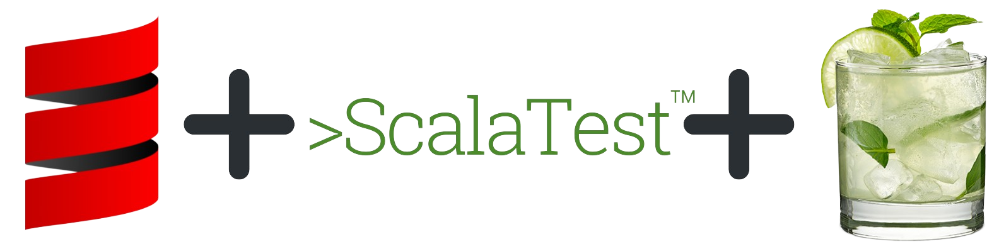

# :books: eureka-scala



A curated list of [Scala](https://scala-lang.org/) solutions for problems regarding algorithms and data structures! The project is shipped with a testing environment for learning and experimenting.\
Tests are written in [ScalaTest](https://www.scalatest.org/) and mocks in [Mockito](https://www.scalatest.org/plus/mockito).\
The following table explains the meaning of commonly used aliases throughout the project:

|            Alias            |    Solution    |
|:---------------------------:|:--------------:|
|       :arrow_up_down:       |   iterative    |
|  :arrows_counterclockwise:  |   recursive    |
| :twisted_rightwards_arrows: | multi-threaded |


## :pushpin: Installation

```shell
# Clone the repository from GitHub
$ git clone https://github.com/leowajda/eureka-scala.git
# Navigate to root directory
$ cd eureka-scala
# Launch sbt console
$ sbt
# (Optional) Run all the tests
$ test
```

## :pencil2: Index

| ID  |                       Name                        |                                                            Solution                                                            |
|:---:|:-------------------------------------------------:|:------------------------------------------------------------------------------------------------------------------------------:|
|  1  | [Two Sum](https://leetcode.com/problems/two-sum/) | [:arrows_counterclockwise:](https://github.com/leowajda/eureka-scala/blob/master/src/main/scala/array/recursive/LC_0001.scala) |


